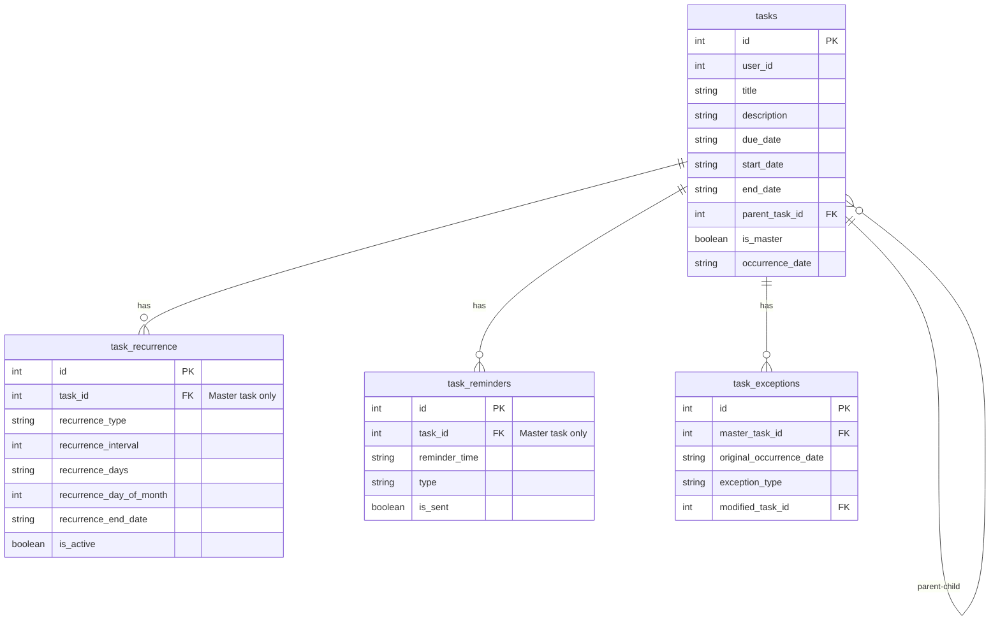
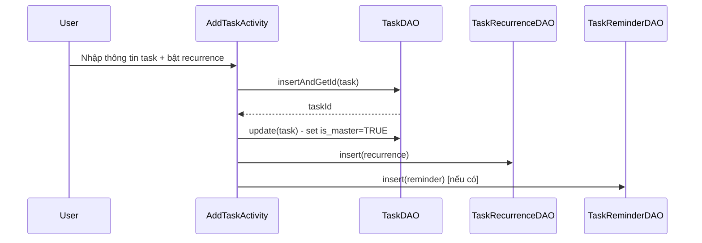
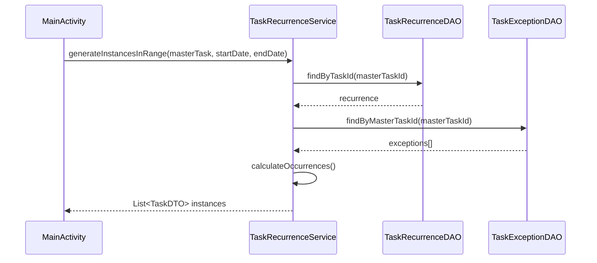
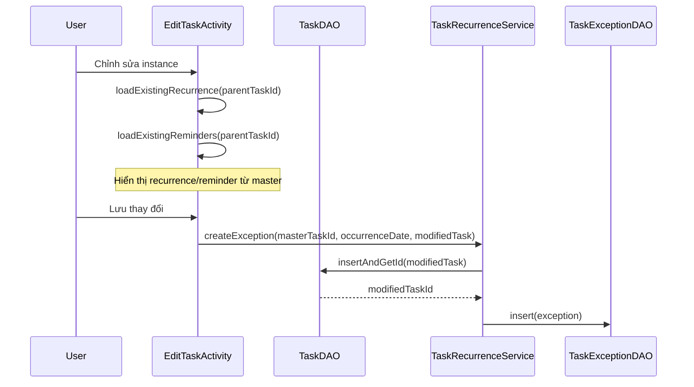

# Hệ thống Recurrence (Lặp lại) - Tài liệu kỹ thuật

## Tổng quan

Hệ thống recurrence cho phép người dùng tạo các task lặp lại theo chu kỳ (hàng ngày, hàng tuần, hàng tháng, hoặc tùy chỉnh). Hệ thống sử dụng mô hình **Master Task** và **Instance** để quản lý các task lặp lại một cách hiệu quả.

## Kiến trúc

### Master Task vs Instance Task

#### Master Task
- **Định nghĩa**: Task gốc chứa thông tin chung và quy tắc lặp lại
- **Đặc điểm**:
  - `is_master = TRUE`
  - `parent_task_id = NULL`
  - Có một bản ghi trong bảng `task_recurrence` chứa quy tắc lặp lại
  - Có thể có reminder trong bảng `task_reminders`
- **Vai trò**: Định nghĩa pattern và metadata chung cho tất cả các instance

#### Instance Task
- **Định nghĩa**: Task được tạo động từ master task cho một ngày cụ thể
- **Đặc điểm**:
  - `is_master = FALSE`
  - `parent_task_id` trỏ đến master task ID
  - `occurrence_date` chứa ngày của instance này
  - **KHÔNG** có bản ghi trong `task_recurrence` (dùng chung từ master)
  - **KHÔNG** có reminder riêng (dùng chung từ master)
- **Vai trò**: Đại diện cho một lần xuất hiện cụ thể của task lặp lại

### Sơ đồ mối quan hệ



## Cấu trúc Database

### Bảng `tasks`

| Trường | Kiểu | Mô tả |
|--------|------|-------|
| `id` | INT | Primary key |
| `user_id` | INT | ID người dùng sở hữu task |
| `title` | VARCHAR | Tiêu đề task |
| `description` | TEXT | Mô tả task |
| `due_date` | DATE | Ngày hết hạn (yyyy-MM-dd) |
| `start_date` | DATE | Ngày bắt đầu recurrence (master task) |
| `end_date` | DATE | Ngày kết thúc recurrence (master task) |
| `parent_task_id` | INT NULL | ID master task (NULL nếu là master) |
| `is_master` | BOOLEAN | TRUE nếu là master task |
| `occurrence_date` | DATE NULL | Ngày occurrence (NULL nếu là master) |

### Bảng `task_recurrence`

| Trường | Kiểu | Mô tả |
|--------|------|-------|
| `id` | INT | Primary key |
| `task_id` | INT | ID master task (FK) |
| `recurrence_type` | VARCHAR | Loại: 'daily', 'weekly', 'monthly', 'custom' |
| `recurrence_interval` | INT | Khoảng cách (ví dụ: mỗi 2 ngày = 2) |
| `recurrence_days` | VARCHAR | Ngày trong tuần (weekly): '1,3,5' (1=Thứ 2, 7=Chủ nhật) |
| `recurrence_day_of_month` | INT NULL | Ngày trong tháng (monthly): 1-31 |
| `recurrence_end_date` | DATE NULL | Ngày kết thúc lặp lại |
| `is_active` | BOOLEAN | Trạng thái active |

### Bảng `task_reminders`

| Trường | Kiểu | Mô tả |
|--------|------|-------|
| `id` | INT | Primary key |
| `task_id` | INT | ID master task (FK) |
| `reminder_time` | DATETIME | Thời gian nhắc nhở (yyyy-MM-dd HH:mm:ss) |
| `type` | VARCHAR | Loại reminder: 'notification' |
| `is_sent` | BOOLEAN | Đã gửi hay chưa |

### Bảng `task_exceptions`

| Trường | Kiểu | Mô tả |
|--------|------|-------|
| `id` | INT | Primary key |
| `master_task_id` | INT | ID master task (FK) |
| `original_occurrence_date` | DATE | Ngày occurrence bị exception |
| `exception_type` | VARCHAR | 'modified' hoặc 'deleted' |
| `modified_task_id` | INT NULL | ID task đã chỉnh sửa (nếu type='modified') |

## Luồng hoạt động

### 1. Tạo Task Lặp lại



**Quy trình**:
1. User tạo task mới và bật recurrence
2. Task được lưu với `is_master = TRUE`
3. Recurrence rule được lưu vào `task_recurrence` với `task_id` = master task ID
4. Reminder (nếu có) được lưu vào `task_reminders` với `task_id` = master task ID

### 2. Generate Instances (Tạo Instance động)



**Quy trình**:
1. `MainActivity` gọi `generateInstancesInRange()` để tạo instances trong khoảng thời gian
2. Service load recurrence rule từ master task
3. Service load exceptions (nếu có)
4. Service tính toán các ngày occurrence dựa trên recurrence rule
5. Với mỗi ngày occurrence:
   - Kiểm tra xem có exception không
   - Nếu có exception type='deleted': bỏ qua
   - Nếu có exception type='modified': load task đã chỉnh sửa
   - Nếu không có exception: tạo TaskDTO từ master task
6. Trả về danh sách TaskDTO (không lưu vào database)

**Lưu ý quan trọng**: Instances được **generate động** khi hiển thị, không lưu vào database. Chỉ khi user chỉnh sửa một instance cụ thể thì mới tạo exception và lưu task đã chỉnh sửa.

### 3. Chỉnh sửa Task

#### 3.1. Chỉnh sửa Master Task

Khi chỉnh sửa master task, có 3 tùy chọn:

**a) Chỉnh sửa lần này (OPTION_THIS_OCCURRENCE)**
- Tạo exception type='modified'
- Tạo task mới với thông tin đã chỉnh sửa
- Master task và các instance khác không thay đổi

**b) Từ lần này trở đi (OPTION_FROM_THIS_FORWARD)**
- Split recurrence:
  - Cập nhật recurrence cũ: `end_date = splitDate - 1`
  - Tạo master task mới từ `splitDate`
  - Tạo recurrence mới cho master task mới
- Master task cũ và các instance trước `splitDate` không thay đổi

**c) Tất cả các lần (OPTION_ALL_OCCURRENCES)**
- Cập nhật master task
- Xóa recurrence cũ và tạo recurrence mới (nếu có thay đổi)
- Tất cả instances sẽ được generate lại với thông tin mới

#### 3.2. Chỉnh sửa Instance Task



**Quy trình**:
1. Khi mở form edit cho instance:
   - Load recurrence từ master task (`parent_task_id`)
   - Load reminder từ master task (`parent_task_id`)
   - Hiển thị thông tin instance hiện tại
2. Khi lưu:
   - Tạo exception type='modified'
   - Lưu task đã chỉnh sửa với `parent_task_id` = master task ID
   - Instance đã chỉnh sửa sẽ được load từ database thay vì generate từ master

### 4. Xử lý Exceptions

Exceptions được sử dụng để đánh dấu các instance đã bị chỉnh sửa hoặc xóa riêng lẻ.

**Exception Type: 'modified'**
- Instance đã được chỉnh sửa riêng
- `modified_task_id` trỏ đến task đã chỉnh sửa
- Khi generate instances, load task đã chỉnh sửa thay vì tạo từ master

**Exception Type: 'deleted'**
- Instance đã bị xóa
- `modified_task_id = NULL`
- Khi generate instances, bỏ qua instance này

## Các trường hợp đặc biệt

### 1. Task Instance không có Recurrence/Reminder riêng

**Vấn đề**: Khi chỉnh sửa instance, form không hiển thị recurrence và reminder.

**Nguyên nhân**: Code đang dùng `task.getId()` (instance ID) để load recurrence/reminder, nhưng dữ liệu này được lưu cho master task.

**Giải pháp**: Kiểm tra `parent_task_id`:
- Nếu có `parent_task_id`: load từ master task (`parent_task_id`)
- Nếu không có: load từ chính task đó

**Code fix** (trong `EditTaskActivity`):
```java
// Trong loadExistingRecurrence() và loadExistingReminders()
int taskIdToLoad = taskId;
if (currentTask != null && currentTask.getParentTaskId() != null && currentTask.getParentTaskId() > 0) {
    taskIdToLoad = currentTask.getParentTaskId();
}
```

### 2. Split Recurrence

Khi user chọn "Từ lần này trở đi":
1. Recurrence cũ được cập nhật: `recurrence_end_date = splitDate - 1`
2. Master task mới được tạo với `due_date = splitDate`
3. Recurrence mới được tạo cho master task mới
4. Cả hai master task đều active và generate instances riêng

### 3. Dynamic Instance Generation

Instances không được lưu vào database để:
- Tiết kiệm dung lượng
- Tránh phải sync khi recurrence rule thay đổi
- Dễ dàng thay đổi date range hiển thị

Chỉ khi user chỉnh sửa một instance cụ thể thì mới tạo exception và lưu task đã chỉnh sửa.

## Format dữ liệu

### Recurrence Days Format (Weekly)
- Database format: `"1,3,5"` (1=Thứ 2, 7=Chủ nhật)
- Calendar format: `Calendar.MONDAY=2, Calendar.SUNDAY=1`
- Conversion:
  - Database → Calendar: `(dbDay == 7) ? Calendar.SUNDAY : dbDay + 1`
  - Calendar → Database: `(day == Calendar.SUNDAY) ? 7 : day - 1`

### Date Formats
- Database: `yyyy-MM-dd` (ví dụ: `2025-12-22`)
- Display: `dd/MM/yyyy` (ví dụ: `22/12/2025`)
- DateTime (Reminder): `yyyy-MM-dd HH:mm:ss` (ví dụ: `2025-12-22 14:30:00`)

## Best Practices

1. **Luôn kiểm tra parent_task_id**: Khi làm việc với task, luôn kiểm tra xem có phải instance không
2. **Load dữ liệu từ master**: Recurrence và reminder luôn được load từ master task
3. **Exception handling**: Luôn kiểm tra exceptions trước khi generate instances
4. **Date range**: Chỉ generate instances trong date range cần thiết để tối ưu performance
5. **Validation**: Validate recurrence end date phải sau due date

## Troubleshooting

### Vấn đề: Form edit không hiển thị recurrence/reminder cho instance

**Triệu chứng**: Khi chỉnh sửa task instance, các trường recurrence và reminder trống.

**Nguyên nhân**: Code đang load từ instance ID thay vì master task ID.

**Giải pháp**: Sửa `loadExistingRecurrence()` và `loadExistingReminders()` để kiểm tra `parent_task_id`.

### Vấn đề: Instances không được generate

**Triệu chứng**: Master task có recurrence nhưng không thấy instances.

**Nguyên nhân có thể**:
- Recurrence `is_active = FALSE`
- Date range không bao phủ occurrence dates
- Recurrence end date đã qua

**Giải pháp**: Kiểm tra recurrence rule và date range.

## Tài liệu tham khảo

- `TaskRecurrenceService.java`: Service xử lý recurrence logic
- `EditTaskActivity.java`: Activity chỉnh sửa task (đã fix load từ master)
- `TaskRecurrenceDAO.java`: DAO cho bảng task_recurrence
- `TaskExceptionDAO.java`: DAO cho bảng task_exceptions

